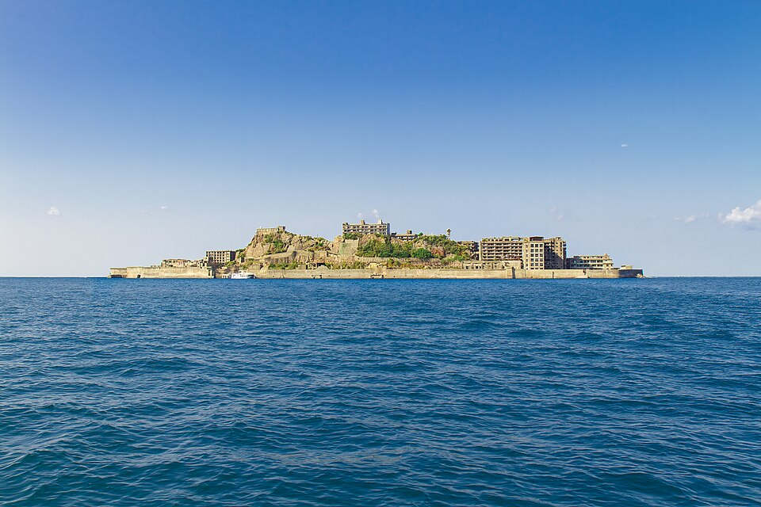

# Module 1 (Describing) - Proficient Band - Lesson 1: Forty-Five Minutes on Battleship Island

**Module:** 1, Describing | **Band:** Proficient (Levels 7-8, C1-C2) | **Anchor text calibrated to:** Level 7
**Task Levels this lesson:** 5 and 6 (extension-down), 7 and 8 (native)
**Genre:** Full newspaper feature paired with an investigative article | **Reading Strategy:** Close Reading with Annotation
**Phase 1 Hook:** Visual Inquiry | **Phase 3 Protocol:** Panel Round
**Vocabulary Theme:** Ruin, decay and industrial concrete (seawall, reinforced, cordon, weathered, swell, subsidence)
**Topic:** The prescribed visitor route on Hashima Island (Gunkanjima), Nagasaki, described by a tour operator and by a reporter who took the same tour
**Version:** 1.1.1.0

Generated per `Generate_Lesson_Prompt_v3.5.md`, following the approved `Module1_Proficient_Lesson_Plan.md`,
Lesson 1 row. Run with `shared/Program_Conventions.md` and `shared/Generation_Quality_Standards.md`.

**Fictional-subject note:** Hashima Island, its coal-mining history, its 1974 closure, its 2015 UNESCO listing,
the fixed landing route and the 45-to-60-minute time limit set by Nagasaki City are all real and documented. The
two writers are not. Text 1 is an invented tour operator's feature and Text 2 an invented reporter's account; no
statement here is attributed to a real, named, identifiable individual, and no operator, publication, or official
named in either text is real.

**Note on the anchor:** at this band the anchor is a **paired text set**, not a single passage. Level 7's
objective requires two extended descriptions of the same subject, and Level 7 is this band's anchor Level
(Conventions §A). Both texts are lettered as one continuous sequence, [A]-[D] for Text 1 and [E]-[H] for Text 2,
so every item can cite a paragraph letter without ambiguity. Levels 5 and 6 work from Text 1 only; Levels 7 and
8 work the pair.

---

## Reading objectives used (verbatim from `learningobjectives.csv`, Module 1: Describing, Reading modality)

| Task Level | Role | Objective |
|---|---|---|
| 5 | Extension-down | Can read an extended description, summarize how the writer organizes details, and identify at least one clearly evaluative word choice that signals the writer's attitude even though the writer never states the opinion directly, decoding unfamiliar words as needed. |
| 6 | Extension-down | Can read an extended description and identify specific word choices that create a positive, negative, or neutral impression, separating explicitly stated description from clearly-signaled evaluative comments, and locate at least one place where the writer's language visibly shifts partway through (e.g. from confident claims to a hedge like "results may vary"). |
| 7 | Native (anchor level) | Can read two extended descriptions of the same subject, critically assess how each writer's rhetorical choices shape a different impression, and identify at least one unstated interest or assumption behind one writer's framing that isn't explicitly acknowledged, using sophisticated inference and register awareness. |
| 8 | Native | Can read a stylistically dense extended description - layered with irony, understatement, or deliberate ambiguity - and (a) map shifts in tone, register, and abstraction to their rhetorical function, (b) identify at least one place where the literal description and the writer's real attitude diverge, and (c) assess how a specific alternate audience would likely misread that divergence. |

---

## DAY 1: COMPREHENSION & TEXT DECODING (75 MIN)

```
DAY 1 PACING
|--Phase 1: Pre-Reading & Activation-----------|--Phase 2: Text Engagement & Annotation--------|--Phase 3: Literal Comp & Vocab---------|
0                                              15                                              50                                        75 (min)
```

### Phase 1: Pre-Reading & Activation (15 min)

**Visual Inquiry hook (board-dependent, 5 min):** Show the photograph below with no caption and no place name.
Ask: "What are we looking at, and what do you think it was?" Collect every answer on the board exactly as
students say it, in two columns headed WHAT IT IS and WHAT IT WAS. Do not confirm or correct anything yet. After
both texts have been read in Phase 2, return to the board and check the class's guesses against Paragraphs [A]
and [B]. The check only exists because the guesses were collected first.

> 
>
> *The island from the water, roughly where the boats turn.*

**Image (Conventions §I):** `Lesson1_Hashima_Img_Hook.jpg` - Commons file "Gunkanjima Island from the Sea.jpg",
Jordy Meow, CC BY-SA 3.0, https://commons.wikimedia.org/wiki/File:Gunkanjima_Island_from_the_Sea.jpg. The credit
row lives in `Set1_Proficient_Image_Credits.md`; the student packet prints the caption only, no credit (Style
Guide §F).

**Skill Spotlight (2 min):** "Today we're practicing describing the same place two different ways, and noticing
how the words a writer chooses decide what impression a reader walks away with. By the end you'll be able to
take one thing and describe it so that a listener sees it the way you want them to see it."

**Target vocabulary (6 min):** Pre-teach these 6 words using in-context paragraph matching. Show each word's own
sentence from the text, cold, and have students propose a meaning from context before you confirm it.

| Word | Paragraph | Student-friendly definition |
|---|---|---|
| seawall | [A] | a long wall built along a shore to stop the sea from reaching the land behind it |
| reinforced (concrete) | [B] | concrete made stronger by steel bars set inside it |
| swell | [C] | the slow rise and fall of the open sea, larger than ordinary waves |
| cordon | [D] | a line or barrier put in place to keep people out of an area |
| weathered | [D] | worn down by years of rain, wind, sun, and salt |
| subsidence | [G] | the slow sinking or settling of ground or of a structure built on it |

**Idiom and register spotlight (2 min):** Four expressions in these texts, on top of the vocabulary budget. At
this band students may guess first, then check against the gloss; the gloss itself never disappears (0.4).

- **"riding low in the sea"** [A] - transparent, nautical register. Sitting deep in the water, the way a heavily
  loaded ship does. Ask what it tells you about the shape of the island before you confirm it.
- **"frozen in time"** [B] - transparent. Unchanged since the moment everyone left.
- **"free rein"** [D] - **opaque, glossed:** complete freedom to go where you like and do as you please. From
  horse riding: loosening the reins lets the horse choose its own way.
- **"skates over"** [F] - **opaque, glossed:** to pass across a difficult subject quickly and lightly instead of
  dealing with it. Students may guess from the image of skating across a surface, then confirm against this gloss.

### Phase 2: Text Engagement & Strategy Execution (35 min)

**Strategy: Close Reading with Annotation.** Students read both texts silently and mark them individually before
any discussion (12 min), then compare their marks with a partner (8 min), then work the annotation key as a class
against Text 1 (15 min). The standing annotation key for this band, printed at the top of the reading in the
packet:

| Mark | What it means |
|---|---|
| underline | a word you cannot decode from context |
| circle | a connector or a hedge ("though," "perhaps," "in some months") |
| [ brackets ] | the sentence that carries the paragraph's main idea |
| ! | a word choice that tells you what the writer thinks, where no opinion is stated |
| ? | a claim you would want to check before believing it |

Leave a wide right margin on the printed page for individual marking. No round-robin reading; nothing here is
read aloud cold.

---

**ANCHOR TEXT SET (Level 7, 692 words total, 8 paragraphs)**

**TEXT 1 (363 words) - from the website of a Nagasaki cruise operator, in its "Long Reads" section**

> **Forty-Five Minutes on Battleship Island**
>
> [A] The boat leaves Nagasaki Port a little after nine, and for the first forty minutes there is nothing to see
> but water and the low green line of the coast. Then the island appears, and every passenger stands up at once.
> From this distance Hashima really does look like a warship riding low in the sea, which is how it earned its
> nickname Gunkanjima, Battleship Island. The grey seawall runs the whole length of it, unbroken, and the
> apartment blocks rise directly behind that wall like a superstructure.
>
> [B] Hashima was a coal-mining community, and at its peak in the 1950s more than five thousand people lived on
> sixteen acres, making it one of the most densely populated places on earth. The mine closed in
> 1974 and the island emptied within weeks. What remains is a company town frozen in time: a school, a hospital,
> a shrine, and Block 65, the reinforced concrete apartment building that had housed miners' families since
> 1918. In 2015 the island was added to the UNESCO World Heritage list¹, and the boats have been busy ever since.
>
> [C] Landing depends entirely on the sea: when the swell is under half a metre the boat ties up at the pier and
> you walk a prepared route of about three hundred metres, with three viewing platforms, for
> forty-five minutes to an hour². Our guides have been making this crossing for years, and they point out the
> stairway the miners climbed to their shift, the roofless gymnasium, and the seawall repairs that hold the island
> together through the typhoon season.
>
> [D] We should be straightforward about what this visit is. The route is fixed and fenced, the standing
> buildings are weathered well past the point of safety, and nothing beyond the cordon is open, interiors
> included. Visitors who arrive expecting free rein among the ruins are, perhaps, the ones we hear from
> afterwards. Landings are also called off in rough weather more often than guests expect, though the
> cruise still circles the island, and that view is the one in every photograph anyway. What we offer is a little more disciplined than the walk some people picture. We think it is also more
> honest.

**TEXT 2 (329 words) - from a feature in an English-language monthly, by a reporter who took the same sailing**

> **What the Route Does Not Reach**
>
> [E] I took the nine o'clock boat in June, with sixty other passengers, and the sea was calm enough to land.
> From the water the island is exactly what the photographs promise: the seawall grey and continuous, the
> apartment blocks stacked behind it, the whole mass sitting low and heavy. Up close that impression changes.
> The seawall is patched in a dozen shades of concrete, and much of what stands
> behind it is no longer a building so much as the frame of one.
>
> [F] Visitors see three platforms and about three hundred metres of walkway along the island's southern edge,
> which is something under a twentieth of it. Block 65, which the commentary names twice, is visible from the
> third platform at perhaps eighty metres, its lower floors hidden behind a spill of fallen concrete. The school,
> the hospital and the shrine stand on the northern half, which no visitor route reaches. Nobody near me seemed
> to know this before arriving, and the loudspeaker commentary skates over it.
>
> [G] Salt and subsidence have done most of the damage. Reinforced concrete of this age fails from the inside
> out, as the steel within it rusts and swells and splits the concrete off in sheets, and engineers have said
> for years that stabilising what still stands would cost far more than the sailings bring in. The
> forty-five-minute limit is a safety measure rather than a scheduling convenience, and cancellations are
> commoner than the booking pages suggest: in some months, well under half of scheduled landings actually happen.
>
> [H] None of this makes the trip not worth taking: the island is extraordinary and the guides know it in
> detail. But the tour describes a company town, and Hashima's mine also worked Korean and Chinese labourers
> brought there under wartime conscription, which the walkway commentary does not raise. Visitors are told carefully
> what they are looking at, and rather less about how much of it they are not looking at, or about what else it
> was.

---

> ¹ Hashima was listed in 2015 as one of the "Sites of Japan's Meiji Industrial Revolution," a group of
> twenty-three places connected to the country's rapid industrialisation in the 1800s.
>
> ² Nagasaki City, not the boat operators, sets the rules for landing on Hashima: the fixed route, the three
> platforms, and the time limit are the same whichever licensed operator a visitor books.

**Board-dependent moment (Phase 1, satisfies Section 0.7):** the WHAT IT IS / WHAT IT WAS columns collected
during the Visual Inquiry hook are returned to at the end of this phase and checked, guess by guess, against
Paragraphs [A] and [B]. The board holds the class's own predictions, which no handout contains.

### Phase 3: Day 1 Literal Comprehension & Vocab Context Check (25 min)

**Fact Finders (Level 5, 8 min).** Answer from Text 1. Write the paragraph letter that gave you the answer.

1. How long does the crossing from Nagasaki Port take before the island comes into view? (Paragraph ___)
   **Answer note:** about forty minutes [A].
2. How many people lived on Hashima at its peak in the 1950s, and on how much land? (Paragraph ___)
   **Answer note:** more than five thousand, on sixteen acres [B].
3. What sea condition does Text 1 say a landing depends on? (Paragraph ___)
   **Answer note:** a swell under half a metre [C].
4. Name two things Text 1 says the guides point out on the walk. (Paragraph ___)
   **Answer note:** any two of: the stairway the miners climbed, the roofless gymnasium, the seawall repairs [C].
5. According to Text 1, what happens to the cruise when a landing is called off? (Paragraph ___)
   **Answer note:** the boat still circles the island [D].

**Stated or signalled (Level 6, 6 min).** For each phrase from Text 1, write **S** if it is stated description
you could check against a record, or **E** if it is the writer signalling an opinion. Then answer question 5.

1. "more than five thousand people lived on sixteen acres" [B]
   **Answer note:** S.
2. "a company town frozen in time" [B]
   **Answer note:** E.
3. "about three hundred metres, with three viewing platforms" [C]
   **Answer note:** S.
4. "the standing buildings are weathered well past the point of safety" [D]
   **Answer note:** E, and note the phrase is doing two jobs at once.
5. Text 1's language changes somewhere in Paragraph [D]. Quote the first three words of the sentence where the
   change begins, and write one sentence on what changes.
   **Answer note:** "Visitors who arrive..." or "Landings are also...". Up to that point the paragraph makes
   flat, checkable statements; from there it moves into hedged language ("perhaps," "more often than most guests
   expect," "We think").

**Framing set (Levels 7 and 8, 6 min).** Answer in one or two sentences each, citing a paragraph letter.

1. (Level 7) Text 1 and Text 2 both describe the walkway and the three platforms. What does Text 2 state about
   them that Text 1 never states?
   **Answer note:** the proportion. Text 2 gives the walkway as something under a twentieth of the island and
   names what is on the unreachable northern half [F]; Text 1 gives the same route in metres and minutes only [C].
2. (Level 8) Paragraph [D] opens "We should be straightforward about what this visit is." Read to the end of
   that paragraph. Does the paragraph do what its first sentence promises? Answer in two or three sentences,
   quoting one phrase.
   **Answer note:** it does and it does not. The restrictions are stated plainly, then reframed: the
   disappointed visitor becomes the one who "arrives expecting free rein," the cancellation becomes a view that
   "is the one in every photograph anyway," and the paragraph closes on "more honest," a claim about the
   operator rather than about the island.

**Vocabulary context completion (all task Levels, 5 min).** Fill each blank with one word from the bank. Two
words are not used.

> **Bank:** seawall · cordon · swell · subsidence · weathered · reinforced

1. The crew waited for the ______ to drop before bringing the boat alongside the pier.
   **Answer note:** swell.
2. Steel bars inside ______ concrete rust as they age, and the rust splits the concrete apart.
   **Answer note:** reinforced.
3. Years of salt and wind had left the door frames ______ down to bare grain.
   **Answer note:** weathered.
4. A ______ was put across the path, and nobody was allowed past it.
   **Answer note:** cordon.

---

## DAY 2: DEEP ANALYSIS, EVALUATION & PRODUCTION (75 MIN)

```
DAY 2 PACING
|--Phase 1: Re-Engagement & Vocab Warm-Up------|--Phase 2: Collaborative Investigation---------|--Phase 3: Panel Round & Synthesis------|
0                                              15                                              45                                        75 (min)
```

### Phase 1: Text Re-Engagement & Vocab Warm-Up (15 min)

**Partner re-scan (3 min):** in pairs, find and read out the three sentences you bracketed as main-idea
sentences in Text 1, and the three you bracketed in Text 2. Say which paragraph letter each came from.

**Vocabulary Refresher Text (8 min).** A different situation entirely, using the same words. Read it, then do
the task under it.

> **NOTICE TO RESIDENTS: PROMENADE AND PIER REPAIRS, PHASE 2**
>
> [A] Work on the promenade begins on 4 March and is expected to last eleven weeks. Contractors will rebuild the
> upper course of the seawall between the lifeboat station and the pier, where survey work last autumn found
> subsidence of up to 90mm under the walkway slabs. The slabs themselves are badly weathered and will be lifted
> and replaced rather than repaired.
>
> [B] A cordon will be in place along the affected stretch for the whole of the work. The pier remains open, and
> access to the beach steps is unaffected except on days when the swell prevents safe working, when the whole
> site may close at short notice. The new sections will be poured as reinforced concrete to the current coastal
> standard, which the 1974 wall was not.
>
> [C] The pier deck itself is not part of this phase. Divers surveyed the pier legs in January and found no
> subsidence there, though two of the cross-braces are weathered enough to be scheduled for replacement in Phase
> 3. Residents who fish from the pier should expect the outer platform to close on any day when the swell runs
> over a metre, as it did for most of last week, whatever stage the promenade works have reached.
>
> [D] Deliveries to the seafront businesses continue throughout. The contractor's compound sits behind a cordon
> on the upper car park, which reduces parking there by about forty spaces until mid-May. Signs will mark the
> diversion for pedestrians at both ends of the closed stretch. The council thanks residents for their patience.
> Questions may be left at the harbour office.

**Task (3-4 min, light):** find and circle the six target words in the notice. Then tell your partner, in one
sentence, what the notice is actually asking residents to accept.
**Answer note:** all six appear, several more than once: seawall, subsidence and weathered in [A]; cordon,
swell and reinforced in [B]; subsidence, weathered and swell again in [C]; cordon again in [D]. The
one-sentence answer is some version of "eleven weeks of a closed walkway, with short-notice closures on rough
days."

**Spoken Vocabulary Mastery (4 min):** answer out loud, in a full sentence, to a partner.
1. Describe one thing near where you live that is visibly weathered. What did the weather do to it?
2. Somewhere you know has a cordon around it, or had one recently. What was it keeping people away from?
3. Which is a slower process, subsidence or a swell, and how would you know the difference by looking?

### Phase 2: Collaborative Multi-Level Investigation (30 min)

**Collaborative Evidence Matrix.** Mixed-ability groups of 4, one student per task Level. Each student completes
their own cell alone first (12 min), then the group shares orally and builds the combined picture (10 min),
then reports one line to the board (8 min).

| Task Level | Cell prompt |
|---|---|
| 5 | Text 1 describes the island in a fixed order. List the order of its four paragraphs in four short phrases, then write down one word from Text 1 that tells you the writer admires the place, even though the writer never says so. |
| 6 | Take Paragraph [A] and Paragraph [D] of Text 1. For each, write one phrase that is plain description and one that is the writer signalling an opinion. Then write the phrase where [D] first turns hedged. |
| 7 | The two texts describe the same three things: the seawall, the apartment blocks, and the parts of the island a visitor cannot reach. Fill one row per subject with each text's own words. Then write one sentence naming an interest Text 1 has that Text 1 never mentions. |
| 8 | Track the register of Text 1 from [A] to [D]: where does it move from scene-setting to sales, and where from sales to defence? Then name the place where its literal description and its real attitude pull apart, and say in one sentence how a reader booking from that same website would take it. |

**Answer note (Level 5):** [A] the approach and the silhouette, [B] the history, [C] what the landing involves,
[D] the limits. Admiring words include "really does look like a warship," "unbroken," "extraordinary" is Text 2,
so accept "unbroken" or "frozen in time."
**Answer note (Level 6):** [A] plain: "The boat leaves Nagasaki Port a little after nine"; signalled: "runs the
whole length of it, unbroken." [D] plain: "The route is fixed and fenced"; signalled: "a little more
disciplined." The hedge turns at "perhaps."
**Answer note (Level 7):** seawall: [A] "runs the whole length of it, unbroken" against [E] "patched in a dozen
shades of concrete." Blocks: [A] "rise directly behind that wall like a superstructure" against [E] "no longer a
building so much as the frame of one." Unreachable parts: [D] "nothing beyond the cordon is open" against [F]
"something under a twentieth of it." The unstated interest: Text 1 sells the sailing, so a cancelled landing has
to be described as no real loss.
**Answer note (Level 8):** [A] scene-setting, [B]-[C] the confident sell, [D] defence. The divergence sits in
[D]: the sentence claiming honesty is the one managing disappointment in advance. A reader booking from that
page reads "more disciplined" and "more honest" as a promise of quality control, not as a warning that they may
never leave the boat.

**Board-dependent moment (Phase 2, satisfies Section 0.7):** as each group reports, build one two-column table
on the board headed TEXT 1 SAYS and TEXT 2 SAYS, one row per subject (the seawall, the blocks, the unreachable
parts). No group holds more than its own row until the board holds all of them.

### Phase 3: Structured Oral Output Debate & Synthesis (30 min) - Panel Round

**Format.** Five students speak in turn from their seats for each prompt window, roughly eight minutes each.
Everyone else listens with the task below. Panel and listeners swap at each changeover, and a new speaker brings
their listening notes with them as material.

**Listener task, every student not speaking (Quality Standards §D7):** keep a running list of three phrases you
hear that describe the island well, noting for each whether the speaker took it from Text 1 or Text 2. You will
be asked for one when your own turn comes.

**Rotated prompts (three, one per changeover):**
1. If you had read only Text 1, what would you picture yourself doing on the island? What would surprise you on
   the day?
2. Both writers describe the seawall. Which description do you trust more, and which sentence made you trust it?
3. Text 2 says the trip is still worth taking. Describe the island to someone in a way that is accurate and
   still makes them want to go.

**Sentence stems by task Level:**
- **Level 5:** "Text 1 describes the island as ___." / "The word ___ tells me the writer ___."
- **Level 6:** "This phrase is description, but this one is opinion, because ___." / "The writing changes at ___,
  where it goes from ___ to ___."
- **Level 7:** "Both texts describe ___, but Text 1 calls it ___ while Text 2 calls it ___." / "Text 1 never says
  it, but it needs ___, which is why ___."
- **Level 8:** "On the surface this says ___; underneath it is doing ___." / "A reader who ___ would take that as
  ___, which is exactly the risk."

**Differentiated participation (Level 5, per 0.8):** the Level 5 student holds the listening task for the first
window rather than speaking, rehearses one sentence with a partner in the thirty seconds before their turn in
the second window, and speaks from that rehearsed sentence. This is their version of the listener task, not an
extra requirement.

**Foundation Support (per Quality Standards §B, if a student is working below Level 5):** they match printed
phrases from the packet to the text each came from, holding up the phrase they wrote on their own paper when
the class reaches it, rather than taking a spoken turn. Nothing here needs the teacher to prepare anything.

**Group Synthesis and Closing Transfer Check (5 min).** Close the board table by asking which single row
changed the most between the two texts.

Then the Closing Transfer Check, oral, in pairs, nothing collected: **describe the shoes you have on today to
your partner twice. First so that someone would want to buy a pair. Then so that someone would know exactly
what condition they are in.** Same shoes, same facts, two impressions. Cold-call two or three pairs. Students
describe from what they know of their own shoes; nobody takes anything off or holds anything up.

---

## Self-check

### `shared/Generation_Quality_Standards.md` §F (25 items)

1. **Task Levels:** exactly 4 (5, 6, 7, 8), each quoted verbatim from its Reading row above. PASS
2. **Own ceiling:** Levels 5 and 6 work Text 1 alone at their own rows (organization plus one evaluative word;
   stated against signalled plus one visible shift). Neither is asked to compare texts, which is Level 7's row.
   Level 8's added demand is task demand on the same pair, not a harder text. PASS
3. **Module verb:** every item is describing work: order of description, evaluative word choice, impression
   created, two descriptions of one subject. Paragraph [H]'s wartime labour sentence is context, and no item
   tests it. PASS
4. **Respectful Tiers:** Level 5's matrix cell carries a genuine interpretive move (which word reveals an
   unstated attitude), not retrieval alone, and its Panel Round turn is a real speaking turn. PASS
5. **Differentiated participation:** Level 5 gets a different mode (listener task, then a rehearsed sentence),
   not an easier stem inside the same turn; Foundation Support is described at its plug-in point. PASS
6. **No duplicate items:** Fact Finders are locational, the Level 6 set is a classification, the framing set is
   comparative. No item repeats another's target. PASS
7. **Not answerable by scan or elimination:** the Level 6 classification turns on signalled evaluation, not
   surface features; the Level 8 item requires reading the whole paragraph against its own opening claim. PASS
8. **Requires the centerpiece:** every item cites a paragraph letter or quotes a phrase; none is answerable from
   general knowledge of Japan or of ruin tourism. PASS
9. **Padded bank:** the vocabulary bank holds 6 taught words for 4 blanks (+2, per §C4), and neither extra is
   the answer to another item. PASS
10. **Time balance:** Day 1 Phase 3 runs 8 min (5 short items) at Level 5, 6 min (5 items) at Level 6, 6 min (2
    deep items) at Levels 7-8, 5 min shared. Roughly even. PASS
11. **Counted:** anchor 692 words (Text 1 363, Text 2 329), 8 paragraphs, refresher 261 words. Counted, not
    estimated. PASS
12. **Complete inline:** every instruction states its own task; the word bank sits above its blanks and the
    annotation key above the reading. PASS
13. **Spotlight and Transfer Check:** the Spotlight names the skill, not the island, in one sentence for every
    Level; the Transfer Check is the same skill on today's shoes, an object used in no other lesson of this Set. PASS
14. **Board moment each day:** Day 1 the two-column guess board built from student call-outs and checked after
    reading; Day 2 the TEXT 1 SAYS / TEXT 2 SAYS table that no group can fill alone. PASS
15. **Teaching precedes practice:** vocabulary and the four expressions are taught in Phase 1, the annotation
    key opens Phase 2, and every item using them comes afterwards. PASS
16. **Adjacency:** first lesson of the Band's first Set, so no preceding lesson to differ from; differs from
    Lesson 2 of this Set in genre, strategy, hook, and protocol. PASS
17. **Oral protocol:** Panel Round with three rotated prompts, per-Level stems, and an explicit listener task
    for every non-speaker. PASS
18. **Style:** no em-dashes, pacing diagram per day, metadata line with version 1.1.1.0. PASS
19. **Self-contained:** the hook photo is a real fetched Commons file embedded by name and cited, no
    placeholder anywhere, and the Transfer Check needs no object brought or held up. PASS
20. **Self-contained across lessons:** nothing here needs anything from an earlier lesson. PASS
21. **Concrete prompts:** E6's Beginner/Intermediate restriction does not bind this band; the one reflection-
    shaped item (Level 8, Phase 3 question 2) is bounded and tied to a named sentence, which Proficient allows. PASS
22. **Fixed-output Levels:** none in this band. N/A
23. **Answer notes:** every expected answer sits on an `Answer note:` line under its item; no stem or
    parenthetical states what it asks for. The two-source item at Level 7 prints three subjects with each text's
    own words in the matrix row, written into this `.md`, not left to the packet. PASS
24. **Circle/underline instructions:** the annotation key marks a printed page, the refresher's circle task
    circles printed words, and the vocabulary bank is printed above its blanks. PASS
25. **Room-neutral:** Visual Inquiry from seats, silent annotation, seated pair work, Panel Round from seats. No
    furniture moved, no formation, nothing posted. PASS

### `Generate_Lesson_Prompt_v3.5.md` Section 0.3 (13 items)

1. **Word count:** 692 words across the pair, inside Level 7's 600-700 and toward its upper part; each text
   329-363, inside the 300-400 guidance for a paired anchor. Both read as connected prose. PASS
2. **Paragraph count and sentence length:** 8 paragraphs (4 + 4), inside Level 7's 7-11; average sentence
   length 22.7 words in Text 1 and 23.5 in Text 2, inside 20-25. PASS
3. **Clause complexity:** full complex range, which Level 7 allows; no sentence stacks more than two
   subordinate clauses. PASS
4. **Vocabulary scan:** academic and idiomatic register throughout, as Level 7 expects; nothing here needs a
   band above Proficient. PASS
5. **Fact density:** dates and figures are spread and each does work (1918, 1974, 2015, three platforms, three
   hundred metres, forty-five minutes). No biography-style timeline. PASS
6. **Idioms:** four expressions, classified above; both opaque ones ("free rein," "skates over") glossed
   outright, both transparent ones left lightly glossed. Density matches Levels 7-8's three to five. PASS
7. **Refresher text:** 261 words, between one third and one half of the anchor, a council repairs notice unrelated to Hashima,
   reusing all six target words and introducing no new grammar. PASS
8. **Genre:** operator feature plus investigative article, both from the Proficient bank, formatted to their
   real conventions (headline and long-read voice; bylined first-person reporting). PASS
9. **Paragraph lettering and footnotes:** [A]-[H] continuous across the pair, referenced by letter everywhere;
   two footnotes, informational, neither tested. PASS
10. **Phase 3 protocol:** Panel Round with an explicit listener task and three rotated prompts. PASS
11. **Reading strategy:** Close Reading with Annotation, with its key, its silent marking pass, and margin
    space integrated into the layout. PASS
12. **Fixed-output Levels:** none in this band. N/A
13. **Answer notes:** as item 23 above. PASS
